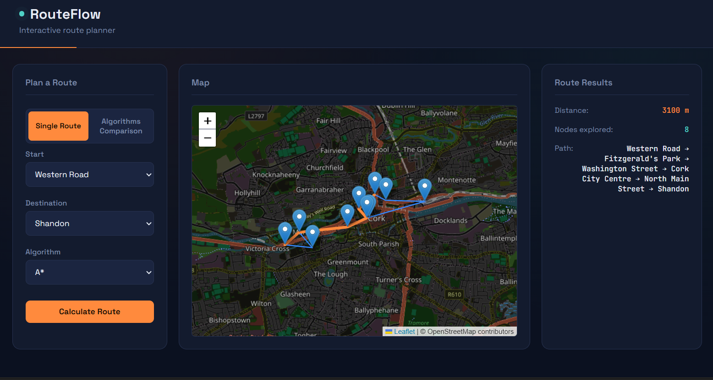
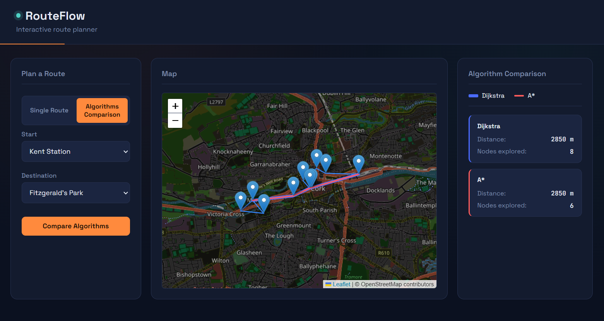

# RouteFlow

RouteFlow is an interactive route planning application that demonstrates and compares Dijkstra's algorithm and A* search on a geographic graph.

The application allows users to select two locations, calculate a route, and visualise the result on an interactive map. Comparison mode runs both algorithms and displays their distance and number of nodes explored.

## Screenshots

### Single Route



### Algorithm Comparison



## Features

- Interactive map using Leaflet and OpenStreetMap
- Route calculation using Dijkstra's algorithm
- Route calculation using A* search
- Geographic Haversine-distance heuristic for A*
- Comparison mode for Dijkstra and A*
- Visualisation of calculated routes on the map
- Comparison of route distance and nodes explored
- REST API built with Flask
- Automated tests using pytest
- Graph data loaded from JSON

## Technologies

- Python
- Flask
- JavaScript
- HTML / CSS
- Leaflet
- OpenStreetMap
- pytest

## Algorithms

### Dijkstra's Algorithm

Dijkstra's algorithm finds the shortest path between a starting vertex and a destination by exploring vertices based on their current known cost.

RouteFlow uses Dijkstra's algorithm as one of its baseline shortest-path algorithms.

### A* Search

A* extends the shortest-path approach by using a heuristic to estimate the remaining distance to the destination.

RouteFlow uses the Haversine formula to estimate the geographical distance between two locations. This allows A* to prioritise vertices that are geographically closer to the destination.

## Algorithm Comparison

RouteFlow includes a comparison mode that runs both algorithms for the same start and destination.

The results show:

- Total route distance
- Number of nodes explored
- The calculated route on the map

This makes it possible to observe how the algorithms behave differently while solving the same routing problem.

## Project Structure

```text
routeflow/
├── backend/
│   ├── app/
│   │   ├── algorithms.py
│   │   ├── graph.py
│   │   ├── routes.py
│   │   └── data/
│   │       └── map.json
│   ├── tests/
│   │   ├── test_algorithms.py
│   │   └── test_routes.py
│   └── run.py
│
├── frontend/
│   ├── index.html
│   ├── style.css
│   └── script.js
│
├── screenshots/
│   ├── routeflow_single.png
│   └── routeflow_comparison.png
│
└── README.md

## Running Locally

### 1. Clone the repository

```bash
git clone <your-repository-url>
cd routeflow
```

### 2. Create and activate a virtual environment

```bash
cd backend
python -m venv venv
```

On Windows:

```powershell
venv\Scripts\activate
```

### 3. Install dependencies

```bash
pip install flask pytest
```

### 4. Run the application

```bash
python run.py
```

The application will be available at:

http://127.0.0.1:5000/

## Running Tests

From the `backend` directory:

```bash
python -m pytest
```

## Purpose

This project was developed to apply graph data structures and pathfinding algorithms to a practical route planning application.

It combines a Flask backend, JavaScript frontend, geographic data, interactive map visualisation, and automated testing.